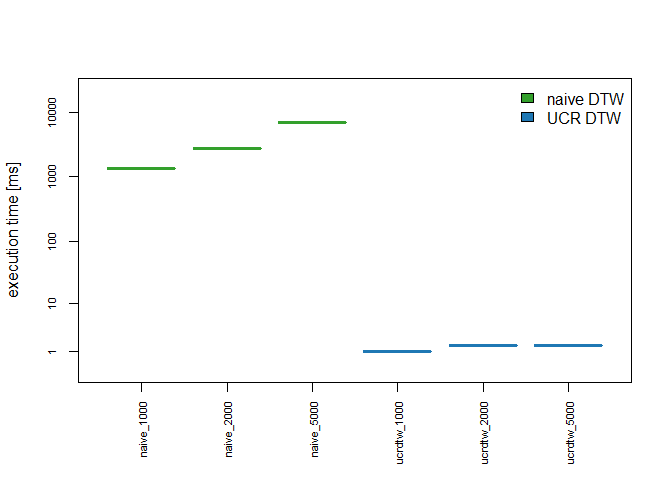

rucrdtw - R Bindings for the UCR Suite
======================================

[](https://travis-ci.org/pboesu/rucrdtw)
[](https://codecov.io/gh/pboesu/rucrdtw)
[](https://cran.r-project.org/package=deBInfer)
[](http://doi.org/10.21105/joss.00100)
[](http://doi.org/10.21105/joss.00100)

R bindings for functions from the [UCR
Suite](http://www.cs.ucr.edu/~eamonn/UCRsuite.html) (Thanawin
Rakthanmanon et al. 2012 SIGKDD), which enables ultrafast subsequence
search under both Dynamic Time Warping and Euclidean Distance. UCR DTW
is several orders of magnitudes faster than naive DTW searches.



Installation
------------

Install `rucrdtw` from GitHub:

``` r
install.packages("devtools")
devtools::install_github("pboesu/rucrdtw")
```

Examples
--------

Examples are contained in the vignette `rucrdtw`:

``` r
library("rucrdtw")
vignette("using_rucrdtw")
```

Citation
--------

To cite rucrdtw in publications, please use:

Boersch-Supan (2016). rucrdtw: Fast time series subsequence search in R.
The Journal of Open Source Software
<a href="http://doi.org/10.21105/joss.00100" class="uri">http://doi.org/10.21105/joss.00100</a>

Rakthanmanon et al. (2012). Searching and mining trillions of time
series subsequences under dynamic time warping. SIGKDD
<a href="http://doi.org/10.1145/2339530.2339576" class="uri">http://doi.org/10.1145/2339530.2339576</a>

Bug reports and contributions
-----------------------------

Please file a github issue at
<a href="https://github.com/pboesu/rucrdtw/issues" class="uri">https://github.com/pboesu/rucrdtw/issues</a>
if you find any problems or have feature suggestions. Contributions (via
pull requests or otherwise) are welcome. If you don’t like github you
can contact the package maintainer at
<a href="mailto:pboesu@gmail.com" class="email">pboesu@gmail.com</a>.

License
-------

COPYRIGHT 2012: Thanawin Rakthanmanon, Bilson Campana, Abdullah Mueen,
Gustavo Batista and Eamonn Keogh. (UCR Suite source code)

COPYRIGHT 2016: Philipp Boersch-Supan (R bindings)

Licensed under the Apache License, Version 2.0 (the “License”); you may
not use this file except in compliance with the License. You may obtain
a copy of the License at

<a href="http://www.apache.org/licenses/LICENSE-2.0" class="uri">http://www.apache.org/licenses/LICENSE-2.0</a>

Unless required by applicable law or agreed to in writing, software
distributed under the License is distributed on an “AS IS” BASIS,
WITHOUT WARRANTIES OR CONDITIONS OF ANY KIND, either express or implied.
See the License for the specific language governing permissions and
limitations under the License.
